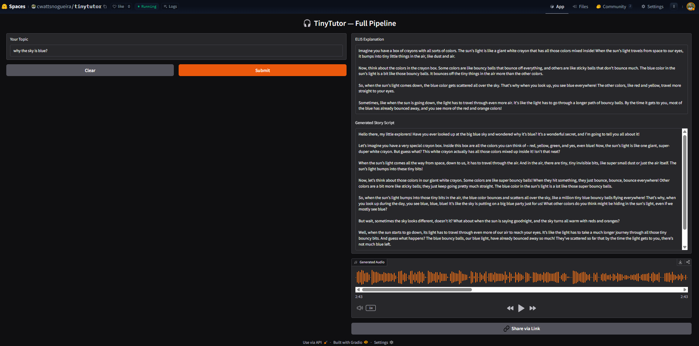

# 🎓 TinyTutor - AI Agentic Educational Media Generator

<div align="center">
  


</div>


<div align="center">
🦉 TinyTutor - Agentic AI Pipeline for Child-Friendly Educational Media
</div>
<div align="center">
Kaggle × Google AI Agents Intensive Course - Capstone Project
</div>

<div align="center">
  
</div>

### 📖 Overview

**TinyTutor** is an agentic AI system that transforms any topic into **clear, emotionally safe, age-appropriate educational content** for young children.

It demonstrates how a coordinated **multi-agent architecture** can perform research, pedagogical simplification, scriptwriting, safety review, and audio generation autonomously.

Developed as part of the **Kaggle × Google 5-Day AI Agents Intensive Course**, TinyTutor explores how agentic systems can transform complex subjects into clear, engaging educational content for young learners.

---

### 🌟 Motivation

Children often encounter explanations that are too abstract or cognitively overwhelming. While LLMs can simplify text, generating *high-quality early-childhood educational material* requires:

- Controlled vocabulary  
- Emotional and content safety  
- Age-appropriate pacing  
- Clear analogies  
- TTS-friendly language  
- Consistent pedagogy  

TinyTutor investigates whether a **role-specialized agentic pipeline** can meet those constraints reliably.

<div align="center">
TinyTutor - Demo Screenshot
</div>
<div align="center">

</div>

---

### 🧩 Multi-Agent Architecture

TinyTutor uses **multiple specialized agents**, each scoped for stability and predictable transformations.

### 1. **Pedagogy Agent**

Defines age range, tone, learning intent, and story style.
Ensures safe, simple, emotionally appropriate language.

### 2. **Audio ScriptWriter Agent**

Creates charming, storybook-style content:

* Short sentences
* Gentle narration
* Repetition for memory
* Clear moral or learning purpose
* Friendly characters

### 3. **Audio Generator Agent**

Rewrites the story for **natural TTS delivery**:

* No bullet points
* No symbols that TTS reads awkwardly
* No robotic phrasing
* Smooth, human flow
* Warm emotional tone

### 4. **Video Generator Agent (coming soon)**

Produces storyboards or simple animated sequences to match the narrative.

---

### 🔧 Technical Implementation

* Built with **Google’s Agent Developer Kit (ADK)**
* Powered by **Gemini** for reasoning, scriptwriting, and content generation
* Uses **Google Cloud Text-to-Speech** (Journey & Neural2 voices)
* Deployable on **Vertex AI Agent Engine**

---

### 🛠️ Key Design Principles
- Explicit **role separation** between agents  
- Structured message schemas for deterministic handoff  
- Safety through redundancy (pedagogy → script → TTS)  

---

### 🧠 System Flow
```
User topic (ex: “What are volcanoes?”)
   ↓
PedagogyAgent  
   ↓  (structured ELI5 explanation)
AudioScriptWriterAgent  
   ↓  (gentle narration)
AudioGeneratorAgent  
   ↓  (MP3/Audio output)
VideoGeneratorAgent (in progress)
   ↓
Final media package
```
---

### 📂 Project Structure

```
.
├── backend/
│   ├── agents/
│   │   ├── __init__.py
│   │   ├── pedagogy_agent.py
│   │   ├── audio_scriptwriter_agent.py
│   │   └── audio_generator_agent.py
│   └── config/
│       ├── main.py
│       └── requirements.txt
│
├── notebooks/
│   ├── 00_master_demo.ipynb
│   ├── 01_eli5_logic/
│   │   ├── 01a_pedagogy_agent.ipynb
│   │   ├── 01b_scriptwriter_audio_agent.ipynb
│   │   └── 01b_scriptwriter_video_agent.ipynb
│   ├── 02_audio_generation_experiments.ipynb
│   ├── 03_video_generation_experiments.ipynb
│   ├── 04_multi-agent_pipeline.ipynb
│   ├── 05_evaluation_and_observability.ipynb
│   └── 06_backend_api_prototyping.ipynb
│
├── .gitignore
├── README.md
```

---

### 🔗 Useful Links (GitHub)

* [backend/agents/pedagogy_agent.py](https://github.com/angelatyk/tinytutor/blob/main/backend/agents/pedagogy_agent.py)
* [backend/config/main.py](https://github.com/angelatyk/tinytutor/blob/main/backend/config/main.py)
* [notebooks/00_master_demo.ipynb](https://github.com/angelatyk/tinytutor/blob/main/notebooks/00_master_demo.ipynb)
* [notebooks/01_eli5_logic/](https://github.com/angelatyk/tinytutor/blob/main/notebooks/01_eli5_logic)
* [notebooks/02_audio_generation_experiments.ipynb](https://github.com/angelatyk/tinytutor/blob/main/notebooks/02_audio_generation_experiments.ipynb)
* [notebooks/03_video_generation_experiments.ipynb](https://github.com/angelatyk/tinytutor/blob/main/notebooks/03_video_generation_experiments.ipynb)
* [notebooks/04_multi-agent_pipeline.ipynb](https://github.com/angelatyk/tinytutor/blob/main/notebooks/04_multi-agent_pipeline.ipynb)
* [notebooks/05_evaluation_and_observability.ipynb](https://github.com/angelatyk/tinytutor/blob/main/notebooks/05_evaluation_and_observability.ipynb)
* [notebooks/06_backend_api_prototyping.ipynb](https://github.com/angelatyk/tinytutor/blob/main/notebooks/06_backend_api_prototyping.ipynb)
* [README.md](https://github.com/angelatyk/tinytutor/blob/main/README.md)

---

### 🚀 Future Features

* **Video Narration Pipeline**

  * ScriptWriter outputs → animated educational shorts
* **Subtitle & Caption Generation**
* **Interactive Learning Mode**

  * Children answer questions via voice
  * Agents respond adaptively
* **Cross-Domain Learning Agents**

  * Healthcare, environment, safety education
* **Multi-Voice Audio Mode**

  * Different characters with different TTS voices

---

### 🚀 Getting Started

Clone the repository:

```
git clone https://github.com/angelatyk/TinyTutor
cd TinyTutor/backend
```

Install dependencies:

```
pip install -r requirements.txt
```

Run an example:

```
python main.py
```

---

### 📄 License

MIT License - free for personal and commercial use.

---

### 👩‍💻 Authors

* **Angela Kwok** [@angelatyk](https://github.com/angelatyk)  
* **Carllos Watts-Nogueira** [@cwattsnogueira](https://github.com/cwattsnogueira)  

**Kaggle × Google – Agents Intensive (Capstone Project)**
*Applying multi-agent AI systems to solve real-world challenges in education.*

---
###  YouTube demo + Hugging Face Spaces live app

[](https://youtu.be/bAAcL3O1oQs) 
[YouTube Demo](https://youtu.be/bAAcL3O1oQs)

[](https://huggingface.co/spaces/cwattsnogueira/tinytutor) 
[Hugging Face Spaces](https://huggingface.co/spaces/cwattsnogueira/tinytutor)


---
